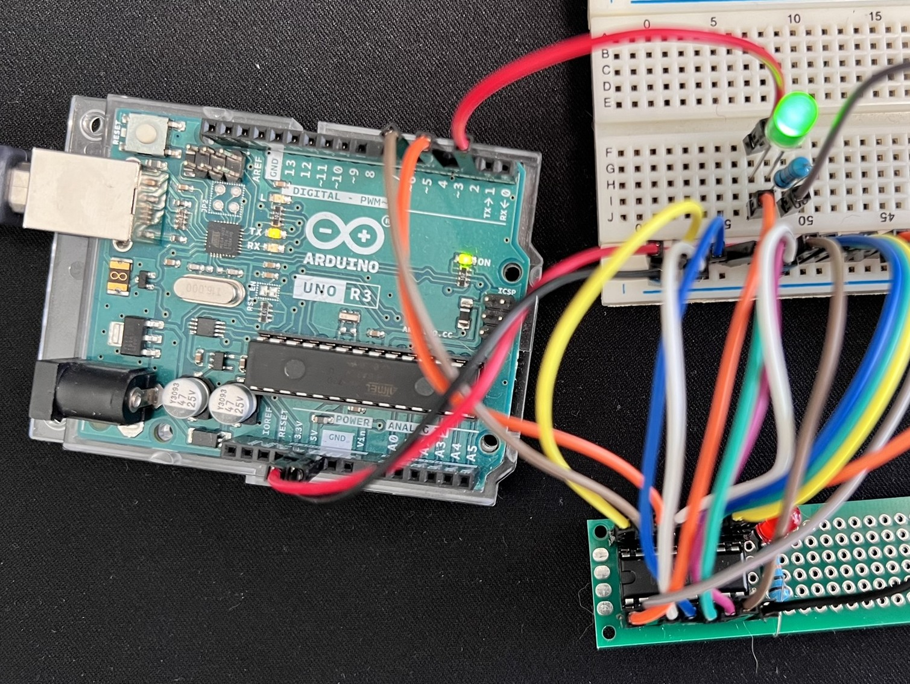
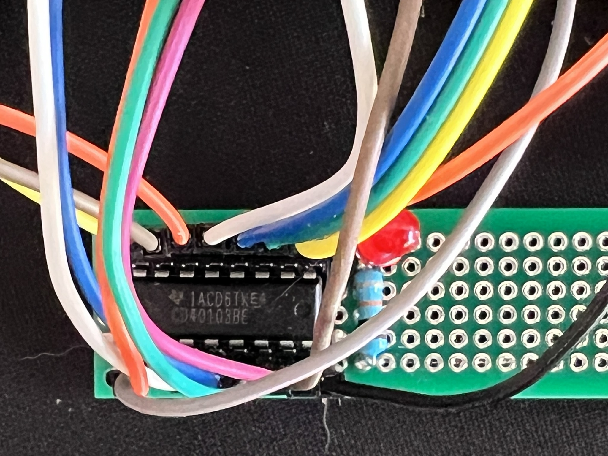
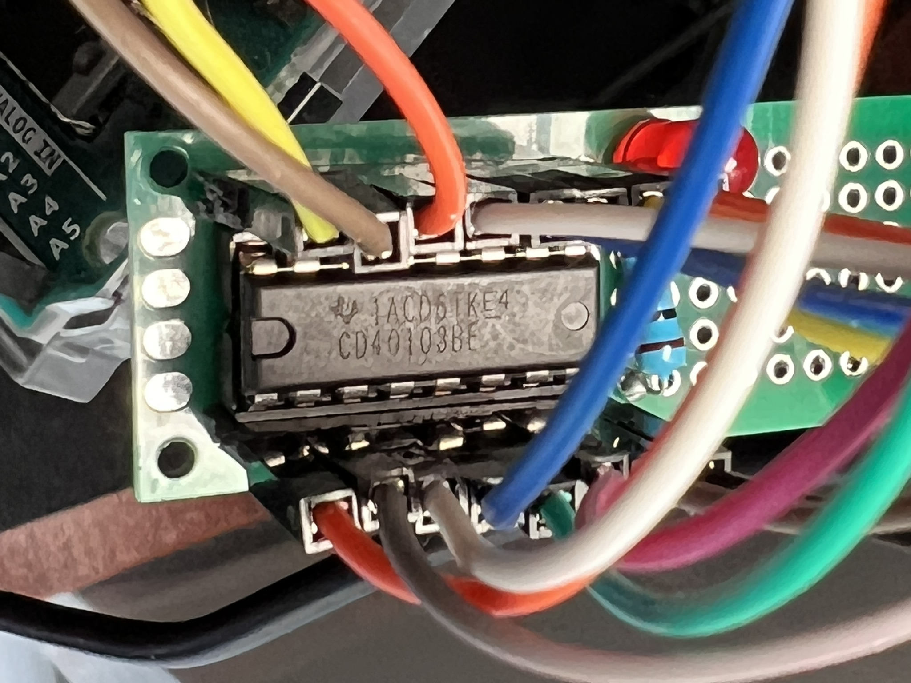

# CD40103BEE4 8-Bit Down Counter with Arduino

 

This project demonstrates interfacing the CD40103BEE4, an 8-bit binary down counter integrated circuit (IC), with an Arduino Uno or compatible board. 
The code simulates a clock signal and counts down from a value pre-loaded on the JAM inputs (J7-J0) of the CD40103.

I built this project because I couldn't find any YouTube videos or tutorials specifically focused on the CD40103. This IC has a lot of potential! Its down-counting functionality can be applied in creative ways across various projects. Hopefully, this serves as a helpful resource for anyone else interested in exploring the CD40103.

## Functionality

* The CD40103 is configured as a down counter.
* An Arduino pin simulates a clock signal for the counter.
* The counter is pre-loaded with a value using the Synchronous Preset Enable (SPE) pin and the JAM inputs.
* The Carry Out / Zero Detect (CO/ZD) pin (IC Pin 14) of the CD40103 goes LOW for one clock cycle when the counter reaches zero.
* An LED connected to the Arduino reflects the state of the CO/ZD pin.
* Serial communication is used to print information about the counter state (clock cycles and CO/ZD state) to the serial monitor.

## Hardware Requirements

* Arduino Uno or compatible board
* CD40103BEE4 IC [Mouser Link](https://mou.sr/4aeHEmU) [Datasheet](https://www.ti.com/lit/ds/symlink/cd40103b.pdf)
* Breadboard
* Jumper wires
* LED (any color)
* 220 - 1K ohm resistor (for the LED)

## Software Requirements

* Arduino IDE (Integrated Development Environment) - [https://support.arduino.cc/hc/en-us/articles/360019833020-Download-and-install-Arduino-IDE](https://support.arduino.cc/hc/en-us/articles/360019833020-Download-and-install-Arduino-IDE)

## Circuit Connections (Refer to CD40103 datasheet for more details)

1. Connect the positive leg of the LED through the 220 ohm resistor to the designated LED pin on the Arduino (e.g., `LED_PIN = 13`).
2. Connect the negative leg of the LED to ground (GND).
3. Refer to the CD40103BEE4 datasheet ([https://www.ti.com/lit/ds/symlink/cd40103b.pdf](https://www.ti.com/lit/ds/symlink/cd40103b.pdf)) for pin connections. Connect the relevant pins to the Arduino as follows:
   - Clock (CLK): `CLOCK_PIN` (e.g., Pin 2)
   - VDD (CD40103 Pin 16): +5V Power Supply
   - GND (CD40103 Pin 8): Ground
   - Carry Out / Zero Detect (CO/ZD): `INV_CO_ZD` (Pin 14) (connect to an input pin on the Arduino)
   - Synchronous Preset Enable (SPE): `INV_SYN_PE` (Pin 15) (connect to an output pin on the Arduino)
   - JAM Inputs (J7-J0) (CD40103 Pins 13-4): Connect these pins to Arduino pins or tie them to HIGH/LOW to preset the initial counter value.
## Circuit Connections (Refer to CD40103 datasheet for more details)

This section details the connections between the CD40103BEE4 IC and an Arduino Uno or compatible board. Be sure to refer to the CD40103 datasheet ([https://www.ti.com/lit/ds/symlink/cd40103b.pdf](https://www.ti.com/lit/ds/symlink/cd40103b.pdf)) for pin descriptions and functionalities.

**Power Connections:**

* **VDD (CD40103 Pin 16):** Connect this pin to the +5V power supply rail on your Arduino board.
* **GND (CD40103 Pin 8):** Connect this pin to the ground (GND) rail on your Arduino board.

**LED Connection (Optional):**

* **Anode (Positive Leg):**  Connect this leg of the LED to a designated LED pin on the Arduino (e.g., `LED_PIN = 13`). If your Arduino board has a built-in LED connected to pin 13 (e.g., Arduino Uno), you can skip this step and the following one (connecting the LED cathode to ground).
* **Cathode (Negative Leg):** Connect this leg of the LED to a 220 ohm resistor in series, and then connect the resistor to the ground (GND) rail on your Arduino board. This resistor limits the current flowing through the LED to prevent damage.

**CD40103 Input/Output (I/O) Pin Connections:**

* **Clock (CLK - CD40103 Pin 1):** Connect this pin to an output pin on the Arduino designated as the clock signal pin (e.g., `CLOCK_PIN = 2`). The Arduino will generate a pulse waveform on this pin to control the down-counting of the CD40103.
* **Carry Out / Zero Detect (CO/ZD - CD40103 Pin 14):** Connect this pin to an input pin on the Arduino (e.g., `INV_CO_ZD = 4`). This pin goes LOW for one clock cycle when the counter reaches zero. You can use this signal to trigger events in your Arduino code, such as resetting the counter or performing an action.
* **Synchronous Preset Enable (SPE - CD40103 Pin 15):** Connect this pin to an output pin on the Arduino (e.g., `INV_SYN_PE = 6`). This pin controls when the values on the JAM input pins are loaded into the counter. A LOW pulse on this pin during a positive clock transition latches the JAM input values.

**JAM Input Pins (J7-J0 - CD40103 Pins 13-4):**

These pins are used to pre-load a value (between 0 and 255) into the counter before it starts counting down. You have two options for configuring these pins:

1. **Direct Connection to VCC (HIGH):**
   - Connect all JAM input pins (J7-J0) directly to the +5V power supply rail (VCC) on your Arduino or breadboard. This sets each JAM input to a logical HIGH, resulting in a pre-loaded value of 255 (all bits 1) for the counter.
  
For example if you want to count only from 128 and down to 0, you can set all the pins to logical HIGH except for pin (J7) (CD40103 Pin 13) which you should set to LOW.

2. **Individual Control using Arduino Pins:**
   - Connect each JAM input pin (J7-J0) to a separate output pin on your Arduino. 
   - In your Arduino code, you can set the desired binary value on the JAM pins by writing `HIGH` or `LOW` to the corresponding Arduino output pins connected to each JAM input.
     - A `HIGH` value on a JAM pin represents a 1 in the binary value.
     - A `LOW` value on a JAM pin represents a 0 in the binary value.

For example, to pre-load the counter with a decimal value of 10 (binary equivalent: 00001010), you would connect J1 (CD40103 Pin 5) to an Arduino output pin and set it to `HIGH` in your code. All other JAM input pins (J7-J0 and J2-J6) would be connected to ground (GND) or set to `LOW` in your code.

**Additional Considerations:**

* **Clear (CD40103 Pin 2):** This pin is an asynchronous clear input, meaning a LOW pulse on this pin resets the counter to its maximum value (255

## Code

The `CD40103_DownCounter.ino` file contains the Arduino code for this project. You can find detailed comments within the code explaining each section.

## Usage

1. Download the `CD40103_DownCounter.ino` file and upload it to your Arduino board using the Arduino IDE.
2. Open the serial monitor in the Arduino IDE (Tools -> Serial Monitor).
3. Observe the LED and the serial monitor output to see the counter functionality. The LED will turn ON when the CO/ZD pin is LOW (counter reaches zero) and vice versa. The serial monitor will print the current clock cycle and the CO/ZD state.

## Additional Notes

* This code provides a basic example. You can modify it to explore different functionalities of the CD40103 IC, such as using an external oscillator for the clock signal or connecting the CO/ZD pin to the CLEAR or SPE pin for automatic counter reset or pre-loading.
* Consider error handling mechanisms for robustness.
* Feel free to adjust comments and explanations for better clarity.

## Contributing

I welcome contributions to this project! If you have improvements or suggestions, please create a pull request on GitHub.
